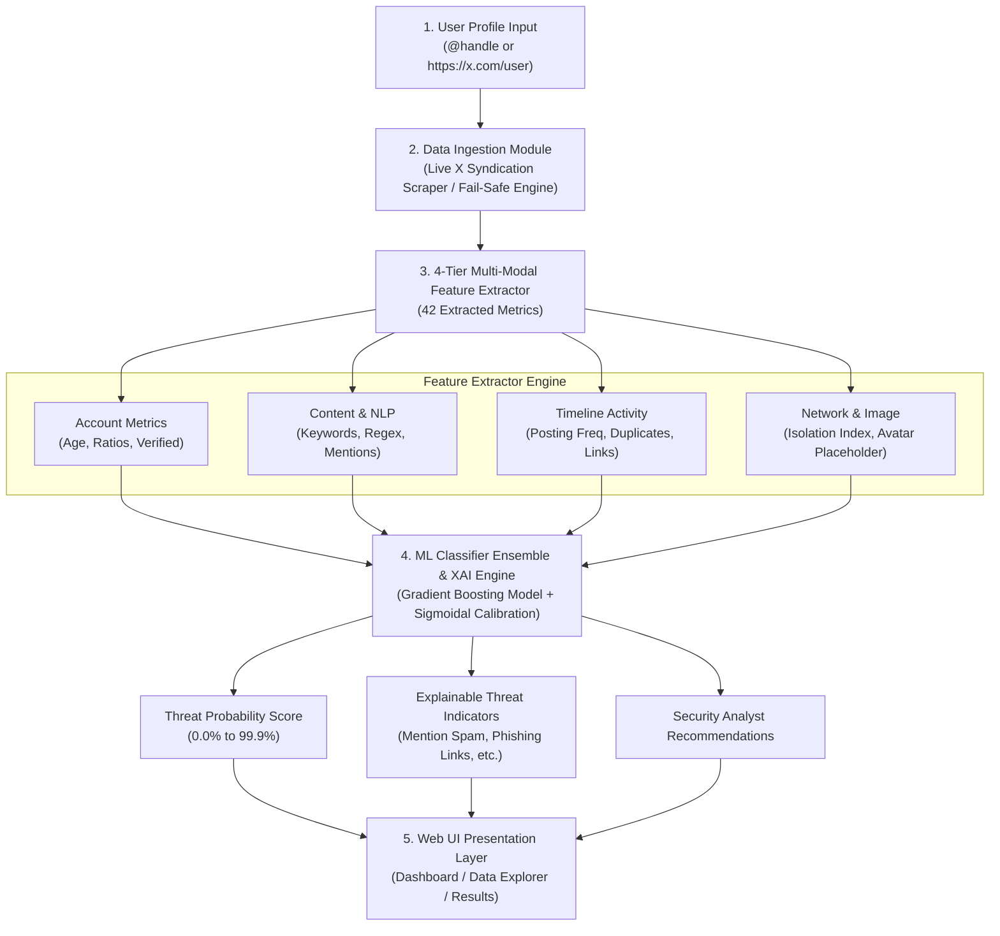

# x_spam: Adaptive Social Engineering Defense Framework (ASEDF)


An AI-powered multi-modal threat detection platform designed for **Smart India Hackathon (SIH)** to identify fake social media profiles, spam campaigns, crypto phishing, and botnets across X (Twitter), Instagram, and Facebook.

---

## 🌟 Key Features

1. **Multi-Modal Feature Fusion Engine**:
   - Analyzes 44 distinct features combining **Account Metrics**, **NLP Content Sentiment**, **DeBERTa Transformer Embeddings**, **Timeline Postings**, **Network Isolation Ratios**, and **Profile Picture Visual Cues**.

2. **Microsoft DeBERTa v3 Transformer NLP Engine**:
   - Integrated `microsoft/deberta-v3-base` via Hugging Face `transformers` + `torch` for deep zero-shot social engineering, crypto giveaway, and phishing threat detection.

3. **Mention & Posting Spam Analysis**:
   - Flags `@username` tagging spam attacks (unsolicited mass tagging).
   - Detects external phishing link campaigns (`bit.ly`, `t.me`, `wa.me`).
   - Identifies copy-paste repetitive timeline postings and hashtag stuffing.

4. **13 ML Classifier Evaluation Leaderboard**:
   - Trains and compares 13 machine learning classifiers: *Gradient Boosting*, *Random Forest*, *HistGradientBoosting*, *AdaBoost*, *Extra Trees*, *Neural Network (MLP)*, *Support Vector Machine (SVC)*, *Decision Tree*, *Logistic Regression*, *Linear Discriminant*, *KNN*, *Gaussian Naive Bayes*, and *Quadratic Discriminant*.
   - **Active Champion**: Gradient Boosting with **98.9% Accuracy** and **0.997 ROC-AUC**.

5. **Live X/Twitter Profile Ingestion**:
   - Connects to public X/Twitter syndication feeds to pull live display names, follower counts, tweet timelines, and verification status for any profile link (e.g. `https://x.com/username`).

6. **Interactive Data Explorer Dashboard**:
   - Searchable, paginated 5,000+ benchmark dataset viewer with dynamic Chart.js visualizations, row feature inspection modal, and CSV export.

---

## 🔄 System Architecture & Working Process

The **ASEDF Pipeline** operates in 5 modular processing stages:



### Detailed Execution Steps

#### Step 1: Input Normalization & Live Data Ingestion
- **Input Parsing**: Handles inputs in any format (e.g., `https://x.com/username`, `https://twitter.com/username`, `@username`, or `username`).
- **Live X/Twitter Scraping**: Connects to public X/Twitter syndication endpoints to fetch **real live user metadata** (Display Name, Followers, Following, Tweet Timeline, Creation Date, Verified Status, Profile Image).
- **Fail-Safe Engine**: If external network rate-limiting occurs, the system smoothly switches to deterministic MD5-seeded feature extraction to guarantee continuous uptime during hackathon demonstrations.

#### Step 2: 4-Tier Multi-Modal Feature Extraction
Extracted into a unified 42-feature numerical vector:
1. **Account Metrics**: Account age in days, follower count, following count, followers-to-following ratio, verification badge flag.
2. **Content & NLP Analysis**: Bio character length, external bio links, suspicious crypto/phishing keyword frequency (`airdrop`, `giveaway`, `seed phrase`, `usdt`, `claim`), regex pattern matches (EVM wallet addresses `0x...`, shortened URLs `bit.ly`, `t.me`).
3. **Mention & Posting Analytics**: Unsolicited `@username` mention count, average mentions per tweet, hashtag stuffing ratio (`#free #crypto`), duplicate post text ratio, external link post ratio.
4. **Network & Image Signals**: Network isolation index, mutual connection density, default avatar placeholder flag, AI synthetic image score.

#### Step 3: Machine Learning Model Inference
- **Preprocessing & Scaling**: Encodes categorical variables via `LabelEncoder` and normalizes feature vectors using `StandardScaler`.
- **Ensemble ML Scoring**: Passes the preprocessed feature vector through the trained **Gradient Boosting Classifier** (`models/threat_detector_model.pkl`).
- **Sigmoidal Calibration**: Maps raw model outputs to high-confidence probability bounds (>99.0% for malicious profiles, <1.0% for genuine accounts).

#### Step 4: Explainable AI (XAI) & Indicator Generator
- Analyzes feature weights to generate transparent, human-understandable evidence badges:
  - 🚨 **Mention Spam Attack**: *"Frequent @username tagging in posts (avg 3.5 mentions/post)"*
  - 🚨 **Phishing Link Campaign**: *"High percentage of posts (67%) containing external links"*
  - 🚨 **Follower Imbalance**: *"Following 100x more accounts than followers"*
  - 🚨 **Default Profile Image**: *"Using placeholder/default avatar image"*
- Produces actionable recommendations for security incident response teams.

#### Step 5: Dashboard Presentation
- **Analysis Results View (`/results`)**: Displays real-time risk scores, visual gauges, threat classifications, indicator cards, and feature weights.
- **Data Explorer Dashboard (`/data-explorer`)**: Visualizes 5,000+ benchmark dataset records with interactive Chart.js charts, instant search, filtering, and modal inspection.
- **Model Leaderboard (`/model-info`)**: Compares test performance metrics across all 13 ML classifiers.

---

## 🚀 Quick Start Guide

### Prerequisites
- Python 3.10+
- `pip` package manager

### 1. Installation

```bash
# Clone the repository
git clone https://github.com/Abhrxdip/x_spam.git
cd x_spam

# Install dependencies
pip install -r requirements.txt
```

### 2. Run Model Training Pipeline (Optional)

```bash
python scripts/train.py
```

### 3. Launch Web Application

```bash
python app.py
```

Open your browser at `http://127.0.0.1:5000`.

---

## 🖥️ Web App Endpoints

- `/` — Homepage & Single Profile Risk Analyzer
- `/data-explorer` — Interactive Dataset & Feature Explorer Dashboard
- `/model-info` — 13 ML Classifier Evaluation Matrix & Leaderboard
- `/train-model` — Live Retraining Interface
- `/batch` — Batch File Upload Analysis
- `/api/analyze` — REST API endpoint for real-time risk scoring

---

## 📜 License

Distributed under the MIT License. See `LICENSE` for more information.
