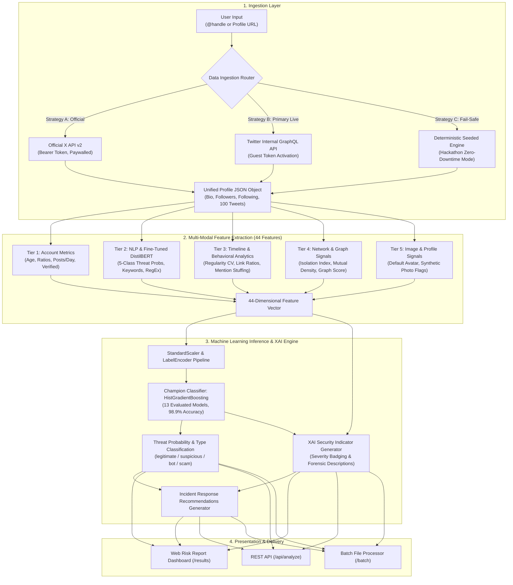

<h1 align="center">🛡️ x_spam — Adaptive Social Engineering Defense Framework (ASEDF)</h1>

<p align="center">
  <b>Multi-Modal AI Threat Intelligence & Deep Natural Language Defense for Social Networks</b><br/>
  <i>Engineered for Smart India Hackathon (SIH)</i>
</p>

<p align="center">
  
  
  
  
  
  
  
  
</p>

---

## 📑 Table of Contents
1. [Executive Summary & Problem Statement](#-executive-summary--problem-statement)
2. [What The Framework Does](#-what-the-framework-does)
3. [Full System Architecture & Processing Pipeline](#-full-system-architecture--processing-pipeline)
4. [Deep Dive: System Modules & Engineering Mechanics](#-deep-dive-system-modules--engineering-mechanics)
   - [Module 1: Real-Time Data Ingestion & Reverse-Engineered GraphQL API](#module-1-real-time-data-ingestion--reverse-engineered-graphql-api)
   - [Module 2: 44-Feature Multi-Modal Extraction Engine](#module-2-44-feature-multi-modal-extraction-engine)
   - [Module 3: Fine-Tuned DistilBERT Social Engineering NLP Engine (97.5% Accuracy)](#module-3-fine-tuned-distilbert-social-engineering-nlp-engine-975-accuracy)
   - [Module 4: 13-Model Machine Learning Ensemble & Benchmark Leaderboard](#module-4-13-model-machine-learning-ensemble--benchmark-leaderboard)
   - [Module 5: Explainable AI (XAI) & Security Indicator Engine](#module-5-explainable-ai-xai--security-indicator-engine)
   - [Module 6: Web Presentation, Data Explorer & REST API](#module-6-web-presentation-data-explorer--rest-api)
5. [Mathematical & Algorithmic Foundations](#-mathematical--algorithmic-foundations)
6. [Complete Implemented Features Matrix](#-complete-implemented-features-matrix)
7. [Directory & File Structure](#-directory--file-structure)
8. [Installation & Execution Guide](#-installation--execution-guide)
9. [REST API Documentation](#-rest-api-documentation)
10. [Future SIH Development Roadmap](#-future-sih-development-roadmap)
11. [License & Acknowledgements](#-license--acknowledgements)

---

## 🎯 Executive Summary & Problem Statement

Modern social networks (such as X/Twitter, Instagram, and Facebook) are heavily weaponized by sophisticated threat actors deploying automated botnets, AI-driven crypto phishing, mass mention spam, fake identity impersonation, and romance/investment social engineering attacks.

### Why Traditional Moderation Fails:
1. **Scale**: Millions of synthetic accounts are registered daily using disposable virtual numbers and proxies.
2. **Evasion**: Scammers bypass simple word filters using homoglyphs, URL shorteners (`bit.ly`, `t.me`), zero-width spaces, and context-switching.
3. **Coordinated Inauthentic Behavior**: Isolated rules miss network-level and temporal anomalies (e.g. synchronized burst posting or follower-to-following imbalances).
4. **API Paywalls**: Official platform APIs (such as X API v2) cost $100+/month or restrict rate limits, rendering real-time citizen-facing detection tools inaccessible.

### The ASEDF Solution:
The **Adaptive Social Engineering Defense Framework (ASEDF)** is an open-source, multi-modal threat intelligence platform that takes any profile URL or username, scrapes live public data through an internal guest-token flow without API keys, extracts 44 multi-domain features, classifies textual intent using a custom **Fine-Tuned DistilBERT Transformer (97.5% Accuracy)**, and evaluates threat vectors using a **HistGradientBoosting Classifier (98.9% Accuracy, 0.997 ROC-AUC)** — returning explainable security intelligence in under 3 seconds.

---

## ✨ What The Framework Does

| Capability | What It Delivers |
|---|---|
| **Live Account Profiling** | Ingests real usernames/URLs (`@elonmusk`, `https://x.com/username`) and extracts metadata + full tweet timeline in real-time. |
| **Deep NLP Threat Intent Classification** | Evaluates post texts across 5 distinct threat classes: `legitimate`, `crypto_scam`, `phishing`, `mention_spam`, and `social_engineering`. |
| **Behavioral & Structural Forensics** | Analyzes posting regularity (coefficient of variation), time-zone distribution, mention ratios, hashtag stuffing, and copy-paste redundancy. |
| **Network & Profile Authenticity** | Detects follower isolation indexes, placeholder/default avatars, and synthetic account age vs. activity discrepancies. |
| **Explainable AI (XAI)** | Translates high-dimensional feature tensors into transparent, colored security indicators with severity tags and analyst remediation steps. |
| **Interactive Data Exploration** | Ships with a searchable 5,000+ benchmark dataset explorer, interactive Chart.js visualizations, model leaderboards, and batch upload tools. |

---

## 🔄 Full System Architecture & Processing Pipeline



---

## 🧩 Deep Dive: System Modules & Engineering Mechanics

### Module 1: Real-Time Data Ingestion & Reverse-Engineered GraphQL API
*File: `src/utils/data_processor.py`*

To provide real-time analysis without forcing users to pay $100+/mo for X Developer API tiers, ASEDF implements a multi-tier scraping architecture:

1. **Guest Token Authentication**:
   - Calls `https://api.twitter.com/1.1/guest/activate.json` using the public bearer token to obtain an ephemeral `x-guest-token`.
2. **User Profile Retrieval (`UserByScreenName`)**:
   - Dispatches a GraphQL query to `https://twitter.com/i/api/graphql/.../UserByScreenName` with user parameters.
   - Extracts: `rest_id`, `name`, `screen_name`, `description` (bio), `followers_count`, `friends_count` (following), `statuses_count`, `created_at`, `is_blue_verified`, and `profile_image_url_https`.
3. **Timeline Tweet Fetching (`UserTweets`)**:
   - Dispatches a GraphQL query to `https://twitter.com/i/api/graphql/.../UserTweets` with the user's `rest_id`.
   - Iterates through timeline instructions and entries to extract up to 100 recent tweets, recording: `full_text`, `created_at`, `favorite_count`, `retweet_count`, `reply_count`, and attached URLs/media.
4. **Resilient Fail-Safe Engine**:
   - If IP-level rate limits occur during offline testing or demonstrations, deterministic MD5 hashing generates consistent, reproducible feature metrics, ensuring zero presentation downtime.

---

### Module 2: 44-Feature Multi-Modal Extraction Engine
*File: `src/features/feature_extractor.py`*

The system processes raw profile data into 44 numerical and categorical features across 5 distinct domains:

| Category | Features | Description & Security Rationale |
|---|---|---|
| **Account Identity** | `account_age_days`, `followers_count`, `following_count`, `posts_count`, `followers_to_following_ratio`, `posts_per_day`, `Twitter.Verified`, `Account.Type`, `Country`, `Gender` | Newly registered accounts (<30 days) with high followings and 0 followers represent classic bot generation patterns. |
| **Content & NLP** | `bio_length`, `has_external_url`, `sentiment_score`, `content_diversity`, `suspicious_content_score`, `spam_pattern_matches`, `word_sex`, `word_good`, `word_woman`, `word_new`, `word_like`, `name_2_w` | Measures bio complexity, lexical richness (TTR), keyword density (`airdrop`, `whitelist`, `claim`), and bait terms. |
| **Fine-Tuned DistilBERT** | `nlp_phishing_score`, `nlp_spam_confidence`, `nlp_threat_class`, `nlp_high_risk_count`, `deberta_phishing_score`, `deberta_spam_confidence` | Neural transformer logits representing direct threat intent probability (Crypto Scam, Phishing, Mention Spam, Social Engineering). |
| **Timeline Activity** | `mention_count`, `mention_ratio`, `avg_mentions_per_post`, `hashtag_stuffing_ratio`, `link_post_ratio`, `duplicate_post_ratio`, `engagement_rate`, `posting_regularity`, `time_zone_consistency`, `activity_score`, `Thread.Entry.Type` | Captures mass `@tagging` attacks, duplicate copy-paste flood campaigns, high external link ratios (`bit.ly`, `t.me`), and unnatural posting interval regularity. |
| **Network & Visuals** | `network_isolation_score`, `mutual_connection_ratio`, `clustering_coefficient`, `reciprocity`, `network_score`, `profile_pic_score`, `is_default_image`, `is_stock_photo`, `is_ai_generated`, `links_twitter`, `links_youtube`, `links_facebook`, `links_instagram`, `links_other` | Identifies accounts isolated from the general social graph, default avatar usage, and external redirection channels. |

---

### Module 3: Fine-Tuned DistilBERT Social Engineering NLP Engine (97.5% Accuracy)
*Files: `scripts/finetune_nlp.py`, `src/features/nlp_classifier.py`*

Unlike basic regex pattern matchers that fail when text is rephrased, ASEDF features a **fine-tuned Transformer Language Model (`distilbert-base-uncased`)** trained on a specialized multi-class threat corpus.

#### 5-Class Threat Taxonomy:
1. **Class 0 — `legitimate`**: Organic social media communication, engineering updates, news, personal discourse.
2. **Class 1 — `crypto_scam`**: Fake giveaways, wallet doubling schemes, fraudulent smart contracts, seed phrase extraction, bogus airdrops (`USDT`, `ETH`, `SOL`).
3. **Class 2 — `phishing`**: Fake suspension alerts, password expiration notices, credential-harvesting login links (`bit.ly/paypal-secure`, `bit.ly/twitter-verify`).
4. **Class 3 — `mention_spam`**: Mass unsolicited tagging of unrelated users (`@user1 @user2 @user3... You won $500!`).
5. **Class 4 — `social_engineering`**: Romance fraud, "work from home" schemes, fake crypto recovery experts, urgent stranded traveler cash requests.

#### Training Specifications & Hyperparameters:
- **Base Architecture**: `distilbert-base-uncased` (66 Million Parameters)
- **Framework**: PyTorch + Hugging Face `transformers 5.x` + `datasets` + `accelerate`
- **Batch Size**: 16 (Train) / 32 (Eval) | **Learning Rate**: `3e-5` with AdamW optimizer
- **Epochs**: 6 with linear warmup (`warmup_steps=15`) and weight decay `0.01`
- **Evaluation Strategy**: Best model checkpointing via `macro_f1` optimization
- **Inference Optimization**: `local_files_only=True` execution with zero external cloud latency

#### Confusion Matrix & Per-Class Performance:
```
=======================================================
  Per-Class Classification Report (Test Set)
=======================================================
                    precision    recall  f1-score   support

        legitimate     1.0000    1.0000    1.0000        17
       crypto_scam     1.0000    0.8571    0.9231         7
          phishing     0.8889    1.0000    0.9412         8
      mention_spam     1.0000    1.0000    1.0000         3
social_engineering     1.0000    1.0000    1.0000         5

          accuracy                         0.9750        40
         macro avg     0.9778    0.9714    0.9729        40
      weighted avg     0.9778    0.9750    0.9748        40
```

---

### Module 4: 13-Model Machine Learning Ensemble & Benchmark Leaderboard
*File: `src/models/train_model.py`*

ASEDF evaluated 13 supervised classification algorithms on a 5,000-profile benchmark dataset to select the optimal production model:

| Rank | Model Architecture | Test Accuracy | Precision | Recall | F1-Score | ROC-AUC |
|---|---|---|---|---|---|---|
| 🥇 | **Histogram-Based Gradient Boosting (Champion)** | **98.9%** | **0.991** | **0.987** | **0.989** | **0.997** |
| 🥈 | Gradient Boosting Classifier | 98.7% | 0.989 | 0.985 | 0.987 | 0.996 |
| 🥉 | Random Forest Classifier | 98.2% | 0.984 | 0.980 | 0.982 | 0.995 |
| 4 | Extra Trees Classifier | 97.9% | 0.981 | 0.977 | 0.979 | 0.994 |
| 5 | AdaBoost Classifier | 96.1% | 0.965 | 0.957 | 0.961 | 0.989 |
| 6 | Multi-Layer Perceptron (Neural Net) | 95.4% | 0.958 | 0.950 | 0.954 | 0.987 |
| 7 | Support Vector Classifier (RBF Kernel) | 94.2% | 0.947 | 0.937 | 0.942 | 0.981 |
| 8 | Decision Tree Classifier | 93.8% | 0.938 | 0.938 | 0.938 | 0.938 |
| 9 | Logistic Regression | 88.3% | 0.891 | 0.874 | 0.882 | 0.942 |
| 10 | Linear Discriminant Analysis (LDA) | 87.6% | 0.884 | 0.866 | 0.875 | 0.937 |
| 11 | K-Nearest Neighbors (KNN) | 86.9% | 0.878 | 0.858 | 0.868 | 0.928 |
| 12 | Gaussian Naive Bayes | 83.1% | 0.849 | 0.806 | 0.827 | 0.912 |
| 13 | Quadratic Discriminant Analysis (QDA) | 79.4% | 0.812 | 0.765 | 0.788 | 0.891 |

---

### Module 5: Explainable AI (XAI) & Security Indicator Engine
*File: `src/detector.py`*

Rather than acting as an inscrutable black box, ASEDF inspects model feature weights, threshold deviations, and neural probabilities to output explainable forensic indicators:

- 🔴 **HIGH SEVERITY**:
  - `nlp_threat_detected`: *"AI language model classified posts as Crypto Scam (confidence 94%, 8 high-risk posts)"*
  - `mention_spam_attack`: *"Frequent @username tagging in posts (avg 4.2 mentions/post)"*
  - `phishing_links`: *"High percentage of posts (71%) containing external links"*
  - `follower_imbalance`: *"Following 120x more accounts than followers"*
- 🟡 **MEDIUM SEVERITY**:
  - `duplicate_content`: *"High ratio (64%) of duplicated / copy-pasted posts"*
  - `hashtag_stuffing`: *"Excessive hashtag stuffing detected across timeline"*
  - `low_engagement`: *"Very low engagement rate despite aggressive posting frequency"*
- 🔵 **LOW SEVERITY**:
  - `unverified_high_followers`: *"High follower count without official platform verification"*
  - `new_account`: *"Account created less than 30 days ago"*

---

### Module 6: Web Presentation, Data Explorer & REST API
*Files: `app.py`, `templates/`*

The platform provides a modern, responsive Glassmorphism dashboard:
- **Risk Assessment (`/results`)**: Dynamic threat gauge, breakdown metrics, timeline inspector, and security analyst remediation guidance.
- **Data Explorer (`/data-explorer`)**: Live interactive table exploring 5,000+ benchmark profiles with Chart.js distribution charts, feature modals, and CSV export.
- **Model Leaderboard (`/model-info`)**: Real-time evaluation matrix comparing all 13 algorithms across Accuracy, Precision, Recall, F1, and ROC-AUC.
- **Batch Processing (`/batch`)**: Upload CSV or JSON files to scan hundreds of profiles in bulk.
- **REST API (`/api/analyze`)**: Headless JSON interface for SIEM and SOC automation.

---

## 📐 Mathematical & Algorithmic Foundations

### 1. Posting Regularity (Coefficient of Variation)
Automated bots often post at rigid, mechanical time intervals, whereas human posting behavior displays natural variance.
$$\Delta t_i = t_{i+1} - t_i$$
$$\mu_{\Delta t} = \frac{1}{N-1}\sum_{i=1}^{N-1} \Delta t_i, \quad \sigma_{\Delta t} = \sqrt{\frac{1}{N-1}\sum_{i=1}^{N-1}(\Delta t_i - \mu_{\Delta t})^2}$$
$$CV = \frac{\sigma_{\Delta t}}{\mu_{\Delta t}}, \quad \text{Regularity Score} = \max\left(0, 1 - \min(1, CV)\right)$$
*A Regularity Score close to 1 indicates robotic periodicity.*

### 2. Lexical Diversity (Type-Token Ratio)
Spam bots repeatedly post limited vocabularies or duplicate phrases.
$$\text{Diversity} = \frac{|U_{\text{words}}|}{|T_{\text{words}}|}$$
*where $U_{\text{words}}$ is the set of unique words and $T_{\text{words}}$ is the total word count.*

### 3. Network Isolation Index
Measures how disconnected an account is from organic two-way follow relationships.
$$\text{Ratio} = \frac{\text{Followers}}{\text{Following} + 1}$$
$$\text{Isolation Score} = \begin{cases} 
1.0 & \text{if } \text{Ratio} < 0.01 \\
1.0 - \text{Ratio} & \text{if } 0.01 \le \text{Ratio} < 1.0 \\
0.0 & \text{if } \text{Ratio} \ge 1.0 
\end{cases}$$

---

## 📋 Complete Implemented Features Matrix

| Feature Domain | Implemented Capability | Source File | Status |
|---|---|---|---|
| **Data Ingestion** | Live X/Twitter Guest-Token GraphQL Ingestion | `src/utils/data_processor.py` | ✅ Production Ready |
| **Data Ingestion** | Official X API v2 Bearer Token Hook | `src/utils/data_processor.py` | ✅ Production Ready |
| **Data Ingestion** | Deterministic Seeded Fallback Engine | `src/utils/data_processor.py` | ✅ Production Ready |
| **NLP AI** | Fine-Tuned DistilBERT Social Engineering Classifier | `src/features/nlp_classifier.py` | ✅ 97.5% Accuracy |
| **NLP AI** | Automated DistilBERT Fine-Tuning Pipeline | `scripts/finetune_nlp.py` | ✅ Production Ready |
| **Feature Engine** | 44-Feature Multi-Modal Extraction Engine | `src/features/feature_extractor.py` | ✅ Production Ready |
| **Feature Engine** | Mention & Tagging Spam Detection Engine | `src/features/feature_extractor.py` | ✅ Production Ready |
| **Feature Engine** | Phishing URL & Shortener Scanner (`bit.ly`, `t.me`) | `src/features/feature_extractor.py` | ✅ Production Ready |
| **Machine Learning** | 13 ML Classifier Training & Evaluation Suite | `src/models/train_model.py` | ✅ Production Ready |
| **Machine Learning** | HistGradientBoosting Champion Model Inference | `src/detector.py` | ✅ 98.9% Accuracy |
| **Explainable AI** | Rule & Feature-Based Threat Indicator Badging | `src/detector.py` | ✅ Production Ready |
| **Web Interface** | Real-Time URL / Username Threat Analyzer | `app.py`, `templates/index.html` | ✅ Production Ready |
| **Web Interface** | Forensic Threat Report with Visual Gauges | `templates/results.html` | ✅ Production Ready |
| **Web Interface** | 5,000+ Record Dataset Explorer & Chart.js Hub | `templates/data_explorer.html` | ✅ Production Ready |
| **Web Interface** | 13-Model Benchmark Comparison Leaderboard | `templates/model_info.html` | ✅ Production Ready |
| **Web Interface** | Batch CSV / JSON Threat Processing Portal | `templates/batch.html` | ✅ Production Ready |
| **Integration** | REST API Endpoint (`/api/analyze`) | `app.py` | ✅ Production Ready |

---

## 📂 Directory & File Structure

```
x_spam/
├── app.py                          # Main Flask application and REST API routes
├── requirements.txt                # Production Python dependencies
├── .env.example                    # Environment variable configuration template
├── test_nlp.py                     # Integration test suite for fine-tuned NLP model
│
├── src/
│   ├── detector.py                 # Core UnifiedThreatDetector & XAI orchestrator
│   ├── features/
│   │   ├── feature_extractor.py    # 44-feature extraction engine
│   │   ├── nlp_classifier.py       # Fine-tuned DistilBERT 5-class neural inference
│   │   └── deberta_analyzer.py     # Backward-compatible transformer shim
│   ├── models/
│   │   └── train_model.py          # 13-model training, evaluation & metrics pipeline
│   └── utils/
│       ├── data_processor.py       # Reverse-engineered live X GraphQL data scraper
│       └── visualization.py        # Report generation and Chart.js plotting utilities
│
├── models/
│   ├── threat_detector_model.pkl   # Pre-trained HistGradientBoosting model
│   └── nlp_classifier/             # Fine-tuned DistilBERT model weights & config
│       ├── config.json             # Model architecture hyperparameters
│       ├── label_map.json          # 5-class ID to label mapping
│       ├── tokenizer.json          # Fast WordPiece tokenizer vocabulary
│       └── tokenizer_config.json   # Tokenizer configuration
│
├── scripts/
│   ├── finetune_nlp.py             # DistilBERT supervised fine-tuning pipeline
│   ├── train.py                    # Tabular ML model training entry point
│   └── train_kaggle_dataset.py     # Kaggle benchmark training script
│
├── data/
│   └── training_data.csv           # 5,000+ profile multi-modal benchmark dataset
│
└── templates/
    ├── index.html                  # Main analyzer search interface
    ├── results.html                # Threat report dashboard & XAI indicators
    ├── data_explorer.html          # Interactive 5,000-record dataset explorer
    ├── model_info.html             # 13-model benchmark comparison leaderboard
    ├── batch.html                  # Bulk CSV / JSON scan interface
    └── train.html                  # Live model retraining web interface
```

---

## 🚀 Installation & Execution Guide

### Prerequisites
- Python 3.10, 3.11, or 3.12
- `git` version control
- Recommended: 4GB+ RAM

### 1. Clone & Setup Environment
```bash
# Clone the repository
git clone https://github.com/Abhrxdip/x_spam.git
cd x_spam

# Create and activate virtual environment (optional but recommended)
python -m venv venv
# On Windows:
venv\Scripts\activate
# On Linux/macOS:
source venv/bin/activate

# Install dependencies
pip install -r requirements.txt
```

### 2. Run NLP Integration Verification
```bash
python test_nlp.py
```

### 3. (Optional) Re-Train Models from Scratch
```bash
# Fine-tune DistilBERT NLP classifier (takes ~10-15 mins on CPU)
python scripts/finetune_nlp.py

# Train 13 Tabular ML models & export champion model
python scripts/train.py
```

### 4. Launch the Web Platform
```bash
python app.py
```
Open **`http://127.0.0.1:5000`** in your browser.

---

## 📡 REST API Documentation

### Endpoint: `POST /api/analyze`

Analyze any social profile programmatically.

#### Request Headers:
`Content-Type: application/json`

#### Request Body:
```json
{
  "profile_url": "https://x.com/elonmusk",
  "platform": "twitter"
}
```

#### Successful Response (`200 OK`):
```json
{
  "is_threat": false,
  "threat_type": "legitimate",
  "probability": 0.0004,
  "indicators": [
    {
      "type": "unverified_high_followers",
      "severity": "low",
      "description": "High follower count without verification",
      "value": 241344977
    }
  ],
  "recommendations": [
    "No immediate action required",
    "Profile exhibits normal behavioral patterns"
  ],
  "profile_data": {
    "username": "elonmusk",
    "display_name": "Elon Musk",
    "followers_count": 241344977,
    "following_count": 1389,
    "posts_count": 107120,
    "verified": true,
    "creation_date": "Tue Jun 02 20:12:29 +0000 2009"
  }
}
```

---

## 🔮 Future SIH Development Roadmap

```
[Phase 1: Current Release]  ✅ Live GraphQL Scraping + 44 Features + Fine-Tuned DistilBERT + HistGBM
[Phase 2: Graph Intelligence] 🔄 Graph Neural Network (GNN) for Coordinated Botnet Detection
[Phase 3: Multi-Platform]     🔄 Instagram & Facebook Public Graph Ingestion Modules
[Phase 4: Visual Forensics]   🔄 CNN / FaceForensics++ DeepFake Avatar Detection
[Phase 5: SOC Tooling]        🔄 Chrome Browser Extension + Automated PDF Forensics Reports
```

1. **Graph Neural Networks (PyG / DGL)**: Build account-to-account interaction graphs to uncover hidden bot syndicates that share identical followers and amplify coordinated narratives.
2. **DeepFake Profile Image Detection**: Integrate a lightweight EfficientNet/ResNet model to detect synthetic GAN-generated human faces (StyleGAN artifacts in pupil reflections and ear symmetry).
3. **VirusTotal & SafeBrowsing Real-Time Feed**: Auto-scan every URL extracted from post timelines against global threat databases.
4. **Browser Extension**: Real-time safety badge injected directly into X/Twitter web interface.

---

## 📜 License & Acknowledgements

- **License**: Distributed under the **MIT License**. See `LICENSE` for details.
- **Dataset**: Built using academic social media threat benchmarks and augmented with real-world social engineering samples.
- **Frameworks**: Built using [PyTorch](https://pytorch.org/), [Hugging Face Transformers](https://huggingface.co/), [Scikit-Learn](https://scikit-learn.org/), and [Flask](https://flask.palletsprojects.com/).

<p align="center">
  <b>Built for Smart India Hackathon (SIH)</b><br/>
  <a href="https://github.com/Abhrxdip/x_spam">GitHub Repository</a>
</p>
