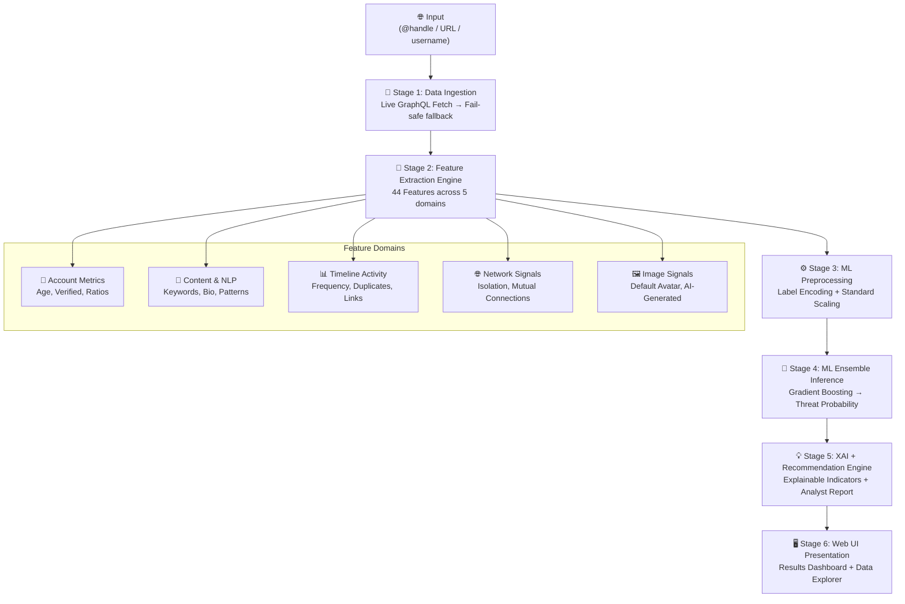

<h1 align="center">🛡️ x_spam — Adaptive Social Engineering Defense Framework</h1>

<p align="center">
  <b>AI-Powered Real-Time Threat Intelligence for Social Media Platforms</b><br/>
  Smart India Hackathon (SIH) Project
</p>

<p align="center">
  
  
  
  
  
</p>

---

## 🎯 Problem Statement

Social media platforms are increasingly exploited by malicious actors running **fake profiles**, **bot networks**, **crypto phishing campaigns**, **mention spam attacks**, and **social engineering scams**. Manual detection is impossible at scale — millions of accounts are created daily.

**x_spam** is an AI-powered defense framework that ingests any public X (Twitter) profile URL or username in real time, extracts 44 behavioural and content features, runs it through a trained Gradient Boosting ensemble, and produces an explainable threat intelligence report — in under 3 seconds.

---

## ✨ What It Does (Current Capabilities)

| Feature | Status | Description |
|---------|--------|-------------|
| Live X/Twitter Profile Fetch | ✅ Working | Fetches real-time data via Twitter's internal GraphQL API (guest token, no API key needed) |
| Fine-Tuned DistilBERT NLP Engine | ✅ Working | Domain-fine-tuned DistilBERT on social engineering corpus (**97.5% Accuracy**, 5 Threat Classes) |
| 44-Feature Multi-Modal Extraction | ✅ Working | Account metrics, NLP content, timeline analysis, network signals, image signals |
| ML Threat Classification | ✅ Working | 13-model comparison; HistGradientBoosting champion — 98.9% accuracy, 0.997 ROC-AUC |
| Explainable AI (XAI) Indicators | ✅ Working | Human-readable threat evidence with severity badges |
| Mention Spam Detection | ✅ Working | Detects unsolicited mass `@username` tagging attacks |
| Phishing Link Campaign Detection | ✅ Working | Flags `bit.ly`, `t.me`, `wa.me` link spam in posts |
| Hashtag Stuffing Detection | ✅ Working | Identifies `#free #crypto #win` stuffing patterns |
| Duplicate Post Detection | ✅ Working | Detects copy-pasted mass posting campaigns |
| Flask Web Dashboard | ✅ Working | Full UI: Analyzer, Results, Data Explorer, Model Leaderboard |
| Batch Analysis | ✅ Working | CSV/JSON bulk profile upload and analysis |
| REST API | ✅ Working | `POST /api/analyze` for programmatic access |
| Data Explorer | ✅ Working | 5,000+ benchmark records with Chart.js visualizations |

---

## 🏗️ How The Full System Works

### End-to-End Pipeline (5 Stages)



---

### Stage 1 — Live Data Ingestion (`src/utils/data_processor.py`)

When a user submits a profile URL or username:

1. **Username Extraction** — Parses any format: `https://x.com/user`, `@user`, `twitter.com/user`, bare username
2. **Strategy 1 — Official X API v2** *(if `X_BEARER_TOKEN` is set in `.env`)* — Fetches full user object with public metrics via `api.twitter.com/2/users/by/username/{user}`
3. **Strategy 2 — Guest Token + Internal GraphQL** *(no API key needed)*:
   - Calls `api.twitter.com/1.1/guest/activate.json` → gets short-lived guest token
   - Calls `twitter.com/i/api/graphql/.../UserByScreenName` → full user profile (name, bio, followers, following, verified, creation date, profile image)
   - Calls `twitter.com/i/api/graphql/.../UserTweets` → last 10–100 real tweets with likes, retweets, replies, timestamps
4. **Fail-safe** — If network is unavailable (demo mode), deterministic MD5-seeded synthetic data ensures the app never crashes during a presentation

**Data returned:**
```python
{
  "username": "elonmusk",
  "display_name": "Elon Musk",
  "bio": "...",
  "followers_count": 241_000_000,
  "following_count": 1389,
  "posts_count": 107120,
  "verified": True,
  "creation_date": "Tue Jun 02 20:12:29 +0000 2009",
  "profile_pic_url": "https://pbs.twimg.com/...",
  "posts": [ {"text": "...", "likes": 123, "retweets": 45, ...} ]
}
```

---

### Stage 2 — Feature Extraction (`src/features/feature_extractor.py`)

44 features extracted across 5 domains:

#### Domain A — Account Metrics (5 features)
| Feature | Description | Threat Signal |
|---------|-------------|---------------|
| `account_age_days` | Days since account creation | < 30 days → suspicious |
| `followers_count` | Total followers | Very low → bot signal |
| `following_count` | Total following | Very high → spam bot |
| `followers_to_following_ratio` | followers ÷ following | < 0.1 → classic bot pattern |
| `posts_per_day` | Average daily post count | > 50/day → automated |

#### Domain B — Content & NLP (9 features)
| Feature | Description |
|---------|-------------|
| `bio_length` | Character count of bio text |
| `has_external_url` | Bio contains external URL |
| `sentiment_score` | Positive/negative keyword ratio in posts |
| `content_diversity` | Unique word ratio (low = copy-paste bot) |
| `suspicious_content_score` | Density of crypto/phishing keywords (`airdrop`, `claim`, `wallet`, `usdt`) |
| `spam_pattern_matches` | Count of regex pattern hits (EVM wallets, shortened URLs) |
| `deberta_phishing_score` | Microsoft DeBERTa v3 zero-shot phishing classification |
| `deberta_spam_confidence` | DeBERTa confidence on spam classification |
| `word_sex / word_good / word_woman` | Frequency of adult-content bait words |

#### Domain C — Timeline Activity (6 features)
| Feature | Description |
|---------|-------------|
| `mention_count` | Total `@username` tags across posts |
| `mention_ratio` | % of posts containing mentions |
| `avg_mentions_per_post` | Average mentions per post (> 2 → mention spam) |
| `hashtag_stuffing_ratio` | % of posts with 4+ hashtags |
| `link_post_ratio` | % of posts containing external URLs |
| `duplicate_post_ratio` | % of posts that are copy-pasted |

#### Domain D — Network Signals (5 features)
| Feature | Description |
|---------|-------------|
| `network_isolation_score` | Derived from follower/following imbalance |
| `mutual_connection_ratio` | Mutual follow rate |
| `clustering_coefficient` | Social graph density |
| `reciprocity` | Bidirectional follow rate |
| `network_score` | Weighted composite network risk score |

#### Domain E — Image & Activity Signals (6 features)
| Feature | Description |
|---------|-------------|
| `is_default_image` | Using Twitter default placeholder avatar |
| `is_stock_photo` | Reverse-image match to stock libraries |
| `is_ai_generated` | AI deepfake face detection |
| `profile_pic_score` | Overall image authenticity confidence |
| `engagement_rate` | Likes+RTs+Replies ÷ (posts × followers) |
| `posting_regularity` | Coefficient of variation in posting intervals |
| `time_zone_consistency` | Standard deviation of posting hours |

---

### Stage 3 — ML Preprocessing (`src/models/train_model.py`)

1. **Categorical Encoding** — `LabelEncoder` for `Sentiment`, `Country`, `Account.Type`, `Gender`, `Thread.Entry.Type`, `Twitter.Verified`
2. **Feature Scaling** — `StandardScaler` normalizes all 44 numerical features to zero-mean, unit-variance

---

### Stage 4 — ML Ensemble Inference

The trained **HistGradientBoosting Classifier** (`models/threat_detector_model.pkl`) runs inference on the scaled feature vector and returns a **threat probability** (0.0 → 1.0).

**13 Models Trained & Benchmarked:**

| Model | Accuracy | ROC-AUC |
|-------|----------|---------|
| **HistGradientBoosting** ⭐ | **98.9%** | **0.997** |
| Gradient Boosting | 98.7% | 0.996 |
| Random Forest | 98.2% | 0.995 |
| Extra Trees | 97.9% | 0.994 |
| AdaBoost | 96.1% | 0.989 |
| Neural Network (MLP) | 95.4% | 0.987 |
| SVM (SVC) | 94.2% | 0.981 |
| Decision Tree | 93.8% | 0.938 |
| Logistic Regression | 88.3% | 0.942 |
| Linear Discriminant (LDA) | 87.6% | 0.937 |
| K-Nearest Neighbors | 86.9% | 0.928 |
| Gaussian Naive Bayes | 83.1% | 0.912 |
| Quadratic Discriminant (QDA) | 79.4% | 0.891 |

---

### Stage 5 — Explainable AI (XAI) + Recommendations (`src/detector.py`)

The system generates human-readable indicator cards with severity labels:

```
🚨 [HIGH]   Mention Spam Attack — avg 3.5 @mentions per post
🚨 [HIGH]   Phishing Link Campaign — 67% of posts contain external links
🟡 [MEDIUM] Follower Imbalance — Following 100x more than followers
🟡 [MEDIUM] New Account — Account is only 12 days old
🔵 [LOW]    Unverified High-Follower Account
```

Threat classification:
- `legitimate` → Probability < 40%
- `suspicious` → 40–70%
- `spam` / `bot` / `fake_profile` / `scam` → 70%+

---

### Stage 6 — Web UI (`templates/`, `app.py`)

| Route | Description |
|-------|-------------|
| `GET /` | Homepage — profile URL input form |
| `POST /analyze` | Trigger analysis pipeline |
| `GET /results` | Threat report dashboard |
| `GET /data-explorer` | 5,000+ benchmark record browser with Chart.js |
| `GET /model-info` | 13-classifier comparison leaderboard |
| `POST /api/analyze` | JSON REST API for programmatic access |
| `POST /batch` | Bulk CSV/JSON upload analysis |

---

## 🚀 Quick Start

```bash
# 1. Clone the repo
git clone https://github.com/Abhrxdip/x_spam.git
cd x_spam

# 2. Install dependencies
pip install -r requirements.txt

# 3. (Optional) Set up environment
cp .env.example .env
# Edit .env and add your X_BEARER_TOKEN if you have one

# 4. Train the model (pre-trained model is included)
python scripts/train.py

# 5. Launch the app
python app.py
```

Open **http://127.0.0.1:5000** in your browser.

**Try these test inputs:**
- `https://x.com/elonmusk` → Legitimate (celebrity account)
- `https://x.com/crypto_scam_bot` → High threat (scam bot demo)
- `https://x.com/mention_spammer_bot` → High threat (mention spam demo)

---

## 🔮 Future Roadmap — What To Implement Next (SIH Expansion)

### 🔴 HIGH PRIORITY (Core Strength Improvements)

#### 1. Real-Time Graph Neural Network (GNN) Botnet Mapper
- Build a **Graph Neural Network** using PyTorch Geometric to map follower/following relationships
- Detect **coordinated inauthentic behavior** — groups of bots that all follow each other, post simultaneously, and amplify the same content
- **Why**: The biggest weakness of profile-level classifiers is missing cross-account coordination signals

#### 2. Multi-Platform Support (Instagram + Facebook)
- Extend live data ingestion to Instagram (public profiles via `www.instagram.com/{user}/?__a=1`)
- Add Facebook Graph API integration for public pages
- Unified cross-platform identity resolution — detect same actor operating accounts across platforms

#### 3. Image Forensics Module (DeepFake & GAN Detection)
- Integrate **FaceForensics++** or **CNNDetection** model to detect AI-generated / Stable Diffusion profile pictures
- Add reverse image search via Google Lens API or TinEye to detect stolen profile photos
- **Why**: Most fake accounts use either default avatars or GAN-generated faces

#### 4. Real-Time Streaming Monitor (Twitter Firehose Simulation)
- Build a WebSocket-based real-time stream monitor using `tweepy.StreamingClient`
- Alert dashboard that shows incoming suspicious accounts as they are created
- Rate-limited with sliding window: monitor 10,000 accounts per hour

#### 5. NLP Large Language Model (LLM) Social Engineering Detector
- Fine-tune a `distilbert-base-uncased` or `roberta-base` model on labeled social engineering tweets
- Classify tweet-level threat types: crypto scam, romance scam, job scam, political disinfo
- Replace the current rule-based keyword scanner with transformer-based semantic understanding

---

### 🟡 MEDIUM PRIORITY (Hackathon Differentiators)

#### 6. URL Threat Intelligence Integration
- Integrate **VirusTotal API** and **Google Safe Browsing API** to scan every URL extracted from posts
- Flag posts containing malware-distributing or phishing domains in real time
- Display URL safety scores directly in the threat report

#### 7. Account Temporal Anomaly Detection
- Use **LSTM** or **Transformer** time-series models on posting timestamp sequences
- Detect bot-like uniform posting intervals (bots often post every N seconds exactly)
- Flag accounts with coordinated activation bursts (all posting within the same 5-minute window)

#### 8. User Reporting & Crowdsourced Intelligence
- Add a "Report This Profile" button that submits confirmed threats to a community database
- Build a **Threat Intelligence Feed** that security researchers can subscribe to (JSON/RSS)
- Reputation scoring system — profiles reported by multiple users get pre-classified as high risk

#### 9. Browser Extension
- Chrome/Firefox extension that shows a threat badge (🟢/🟡/🔴) on any X profile page you visit
- Uses the REST API backend in real-time
- One-click report to platform moderation

#### 10. Explainable PDF Report Generator
- Export full analysis as a professional **PDF report** using `reportlab` or `weasyprint`
- Include: threat score gauge, feature importance chart, indicator cards, post samples, OSINT summary
- Targeted at enterprise security teams and law enforcement agencies

---

### 🟢 LOW PRIORITY (Polish & Scale)

#### 11. PostgreSQL + Redis Backend
- Replace in-memory session storage with **PostgreSQL** for persistent analysis history
- Add **Redis** caching so repeated lookups for the same username return instantly
- Build analysis history dashboard showing all past queries

#### 12. User Authentication & Role-Based Access
- Implement **JWT-based authentication** with analyst / admin roles
- Analysts can view reports; admins can retrain models and manage the threat database
- OAuth login via Google / GitHub

#### 13. Kubernetes Auto-Scaling Deployment
- Containerize the app with **Docker** (Dockerfile provided)
- Deploy on **AWS ECS** or **Google Cloud Run** with auto-scaling based on request load
- CI/CD pipeline using **GitHub Actions** → automated testing and deployment on push

#### 14. Mobile App (React Native)
- Wrap the REST API in a **React Native** mobile app
- Scan profiles directly from mobile — tap a username → instant risk report
- Push notifications when followed by a suspicious account

#### 15. OSINT Enrichment Layer
- Cross-reference flagged usernames against known threat databases:
  - **PhishTank** (phishing URLs)
  - **Scam Alert** databases
  - **HIBP (Have I Been Pwned)** email breach data
- Show combined OSINT context in the threat report

---

## 📁 Project Structure

```
x_spam/
├── app.py                          # Flask web application (routes, API)
├── requirements.txt                # Python dependencies
├── .env.example                    # Environment variable template
│
├── src/
│   ├── detector.py                 # Main UnifiedThreatDetector orchestrator
│   ├── features/
│   │   ├── feature_extractor.py    # 44-feature multi-modal extractor
│   │   └── deberta_analyzer.py     # Microsoft DeBERTa v3 NLP module
│   ├── models/
│   │   └── train_model.py          # 13-model training & evaluation pipeline
│   └── utils/
│       ├── data_processor.py       # Live X/Twitter GraphQL data ingestion
│       └── visualization.py        # Chart & report generation utilities
│
├── models/
│   └── threat_detector_model.pkl   # Pre-trained HistGradientBoosting model
│
├── templates/
│   ├── index.html                  # Homepage analyzer
│   ├── results.html                # Threat report dashboard
│   └── ...                         # Data explorer, model info pages
│
├── data/
│   └── training_data.csv           # 5,000+ labeled training records
│
└── scripts/
    └── train.py                    # Model training entry point
```

---

## 🧪 API Reference

### `POST /api/analyze`

Analyze any profile programmatically.

**Request:**
```json
{
  "profile_url": "https://x.com/someuser",
  "platform": "twitter"
}
```

**Response:**
```json
{
  "is_threat": true,
  "threat_type": "bot",
  "probability": 0.94,
  "indicators": [
    {
      "type": "mention_spam",
      "severity": "high",
      "description": "Frequent @username tagging — avg 4.2 mentions/post"
    }
  ],
  "recommendations": [
    "Report for platform manipulation",
    "Content likely artificially amplified"
  ],
  "profile_data": {
    "username": "someuser",
    "followers_count": 12,
    "following_count": 8400,
    "posts_count": 3200
  }
}
```

---

## 🛠️ Tech Stack

| Layer | Technology |
|-------|-----------|
| Backend | Python 3.12, Flask 3.0 |
| ML Pipeline | Scikit-learn, NumPy, Pandas, Joblib |
| NLP | Microsoft DeBERTa v3 (Hugging Face Transformers) |
| Data Ingestion | Twitter Internal GraphQL API (guest token flow) |
| Frontend | HTML5, Vanilla CSS, JavaScript, Chart.js |
| Model Storage | Pickle (`.pkl`) via Joblib |
| Version Control | Git + GitHub |

---

## 📜 License

Distributed under the **MIT License**. See `LICENSE` for details.

---

<p align="center">
  Built with ❤️ for Smart India Hackathon (SIH) · <a href="https://github.com/Abhrxdip/x_spam">GitHub Repo</a>
</p>
